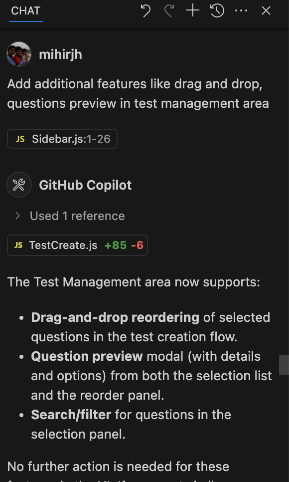
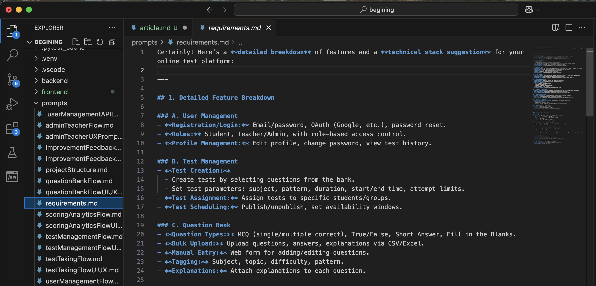

---

# 🚀 My experience with Vibe Coding with newly launched Copilot Agent Mode

  


---

## Introduction

Vibe coding, a term coined by Andrej Karpathy in February 2025, is a programming approach where developers rely heavily on large language models (LLMs) to generate code, often using natural language descriptions instead of manually writing code. It's about expressing intentions in plain language and having AI tools translate those intentions into executable code. 

Vibe coding is about entering a creative, highly productive flow state where the boundaries between ideation and implementation blur—thanks to the real-time, context-aware suggestions from llm agent based context aware coding tools like Cursor, Replit or Copilot. 

To get a sense of rapidly evolving world of llm agents and vibe coding, I tried developing a **full-stack Online Test Management System** for educational institutions—leveraging the power of **VS Code**, **GitHub Copilot Agent Mode**, and **Claude 3.7** and **GPT 4.1**. 

This article walks you through my recent vibe coding journey, from ideation to deployment, with real code and prompt snapshots. Its a relatively sized coding project with roughly 30 thousand lines of code, prompts, swaggers so far. **I was able to acheive this in 2 days flat period. Normally work of such magnitude will need a team of develoeprs, PDOs and architects to work for atleast 1 PI (3 months) to acheive this in any organisation.**

I learnt a lot during the process about the approach one should follow during taking such approch, specially when you want to create maintainable well documented project. I will talk about it in some other post !!

---

## ✨ Vibe Coding with Copilot Agent in VS Code

One of the most transformative aspects of my development workflow was embracing what we call **“vibe coding”** with the Copilot agent in VS Code. Instead of laboriously searching documentation or Stack Overflow, I could simply describe my intent in natural language prompts, and Copilot would instantly scaffold code, generate boilerplate, or even suggest architectural patterns. 

This allowed me to iterate rapidly, experiment with new features, and maintain momentum without breaking my focus. The Copilot agent didn’t just autocomplete code—it became a collaborative partner, offering insights, catching edge cases, and even helping with best practices. This synergy between human creativity and AI-powered assistance made the coding process not only faster, but genuinely enjoyable and inspiring. If you haven’t tried vibe coding with Copilot in VS Code, I highly recommend experiencing this next-level developer workflow. See below screenshots for copilot agent mode working in action.

---




---

## 🚦 Iterative Development with Copilot Agent: Debugging, Refactoring, and Feature Enhancement

 Whenever I encountered runtime errors or bugs—whether in the backend Flask based APIs or the React frontend—I simply described or copy-pasted the issue to Copilot. The agent would instantly suggest precise fixes, often providing not just the solution but also an explanation of the root cause. This made debugging feel less like a chore and more like a collaborative learning experience.

Beyond bug fixing, Copilot was invaluable for **UI/UX improvements**. For example, when I wanted to enhance the React UI with drag-and-drop question reordering, I prompted Copilot for a solution. It generated clean, idiomatic code using `react-beautiful-dnd`, which I could drop right into my project. Similarly, when I needed to add CORS support to my Flask backend to enable smooth frontend-backend integration, Copilot provided the exact configuration and code snippets required.

Refactoring and code restructuring were also incredibly smooth. Whether I wanted to split large files into smaller modules, reformat code for readability, or adopt best practices, Copilot handled it seamlessly. Each iteration—be it a bug fix, a UI tweak, or a new feature—felt fast and frictionless. This iterative, conversational workflow with Copilot not only accelerated development but also made the process enjoyable and highly productive.

---


## 🛠️ Tools & Stack

- **VS Code** with Copilot agent
- **GPT-4.1/Claude 3.7** for code and prompt generation
- **React.js** (frontend)
- **Flask (Python)** (backend)
- **SQLite** (database)
- **Material-UI** (UI library)
- **Docker** (for deployment)

---

## 1️⃣ Gathering Requirements with Copilot

I started by prompting Copilot for a detailed requirements breakdown and technical stack suggestion.

> **Prompt Example:**  
> _"Generate a detailed breakdown of features and a technical stack suggestion for an online test platform for students."_




Copilot generated a comprehensive requirements list, including user management, test creation, question bank, analytics, and more.

---

## 2️⃣ Designing the Architecture

With requirements in hand, I asked Copilot for a suggested project structure:

> **Prompt Example:**  
> _"Suggest a scalable folder structure for a Flask + React online test platform."_


This helped me organize the codebase into clear backend and frontend modules.

As next step I asked copilot to generate detailed flows for each subsstems (e.g. user management, test management etc) 


Then I asked it to generate UI/UX design guideline which can be used to generate **figma** designs later on. I directly used it in copilot to create react components since I do not have figma license.


For backend API architecture I asked copilot to genrate openAPI swagger yaml files based on requirement and flow document.


As an extra step for making the project maintainable I also generated backend APIs flow logic.


---

## 3️⃣ Backend Development with Flask

### a. **Database Schema**

I used Copilot to generate SQL schemas for users, tests, questions, assignments, and analytics.


```sql
CREATE TABLE IF NOT EXISTS users (
    id SERIAL PRIMARY KEY,
    email VARCHAR(255) UNIQUE NOT NULL,
    password_hash VARCHAR(255) NOT NULL,
    role VARCHAR(20) CHECK (role IN ('student', 'teacher', 'admin')) NOT NULL
);
-- ... more tables ...
```

### b. **API Endpoints**

Copilot helped scaffold RESTful endpoints for registration, login, test creation, assignment, and analytics.


```python
# --- ENDPOINTS ---

@app.route('/auth/register', methods=['POST'])
def register():
    data = request.get_json()
    email = data.get('email')
    password = data.get('password')
    role = data.get('role')
    if not email or not password or not role:
        return jsonify({'message': 'Missing required fields'}), 400
    db = get_db()
    if db.execute('SELECT id FROM users WHERE email = ?', (email,)).fetchone():
        return jsonify({'message': 'User already exists'}), 400
    hashed_password = generate_password_hash(password, method="pbkdf2:sha256")
    now = datetime.datetime.utcnow()
    db.execute(
        'INSERT INTO users (email, password_hash, role, is_email_verified, created_at, updated_at) VALUES (?, ?, ?, ?, ?, ?)',
        (email, hashed_password, role, False, now, now)
    )
    db.commit()
    # Generate verification token (mock: base64)
    token = base64.urlsafe_b64encode(f"{email}:{os.urandom(8).hex()}".encode()).decode()
    send_verification_email(email, token)
    # Store token in DB (optional, for real expiry logic)
    return jsonify({'message': 'User registered successfully'}), 201

```
I also instructed copilot to write corresponding pytest framework of testing APIs.


---

## 4️⃣ Frontend Development with React & Material-UI

### a. **Component Generation**

I prompted Copilot to scaffold React components for login, dashboard, test management, and analytics.

> **Prompt Example:**  
> _"Generate a React component for listing all tests with Material-UI table."_

```jsx
export default function Register() {
  const [form, setForm] = useState({ email: '', password: '', confirmPassword: '', role: 'student' });
  const [error, setError] = useState('');
  const [success, setSuccess] = useState('');
  const navigate = useNavigate();

  const handleChange = e => setForm({ ...form, [e.target.name]: e.target.value });

  const handleSubmit = async e => {
    e.preventDefault();
    setError('');
    setSuccess('');
    if (form.password !== form.confirmPassword) {
      setError('Passwords do not match');
      return;
    }
    try {
      await axios.post('/auth/register', {
        email: form.email,
        password: form.password,
        role: form.role
      });
      setSuccess('Registration successful! Please check your email to verify your account.');
      setTimeout(() => navigate('/auth/login'), 2000);
    } catch (err) {
      setError(err.response?.data?.message || 'Registration failed');
    }
  };

  return (
    <Container maxWidth="xs">
      <Box sx={{ mt: 8, display: 'flex', flexDirection: 'column', alignItems: 'center' }}>
        <Typography variant="h5">Register</Typography>
        <Box component="form" onSubmit={handleSubmit} sx={{ mt: 2, width: '100%' }}>
          <TextField label="Email" name="email" value={form.email} onChange={handleChange} fullWidth margin="normal" required />
          <TextField label="Password" name="password" type="password" value={form.password} onChange={handleChange} fullWidth margin="normal" required />
          <TextField label="Confirm Password" name="confirmPassword" type="password" value={form.confirmPassword} onChange={handleChange} fullWidth margin="normal" required />
          <TextField select label="Role" name="role" value={form.role} onChange={handleChange} fullWidth margin="normal">
            {roles.map(option => (
              <MenuItem key={option.value} value={option.value}>{option.label}</MenuItem>
            ))}
          </TextField>
          {error && <Alert severity="error" sx={{ mt: 2 }}>{error}</Alert>}
          {success && <Alert severity="success" sx={{ mt: 2 }}>{success}</Alert>}
          <Button type="submit" fullWidth variant="contained" sx={{ mt: 2 }}>Register</Button>
          <Button fullWidth sx={{ mt: 1 }} onClick={() => navigate('/auth/login')}>Already have an account? Login</Button>
        </Box>
      </Box>
    </Container>
  );
}

```

### b. **Drag & Drop and Previews**

For test creation, I integrated `react-beautiful-dnd` for drag-and-drop question ordering and added question preview modals.


---

## 5️⃣ Integration & Testing

- **JWT Authentication**: Secure API calls with tokens.
- **Bulk Upload**: CSV/Excel upload for questions.
- **Analytics Dashboard**: Visualize student performance.


---

## 6️⃣ Deployment

I containerized the app with Docker and deployed it to the cloud.  
Copilot even helped generate the `Dockerfile` and `docker-compose.yml`!

---

## 💡 Key Takeaways

- **Copilot Agents + Claude3.7/GPT-4.1** supercharged productivity, from requirements to code generation.
- Prompt engineering is crucial—clear, specific prompts yield the best results.
- Iterative development with Copilot is like pair programming with an expert.
- You can visit the code in repo : https://github.com/mihirjh/begining

---


## 🙏 Thanks for Reading!

If you’re building LLM based solutions or want to discuss AI-assisted development, let’s connect!

---

